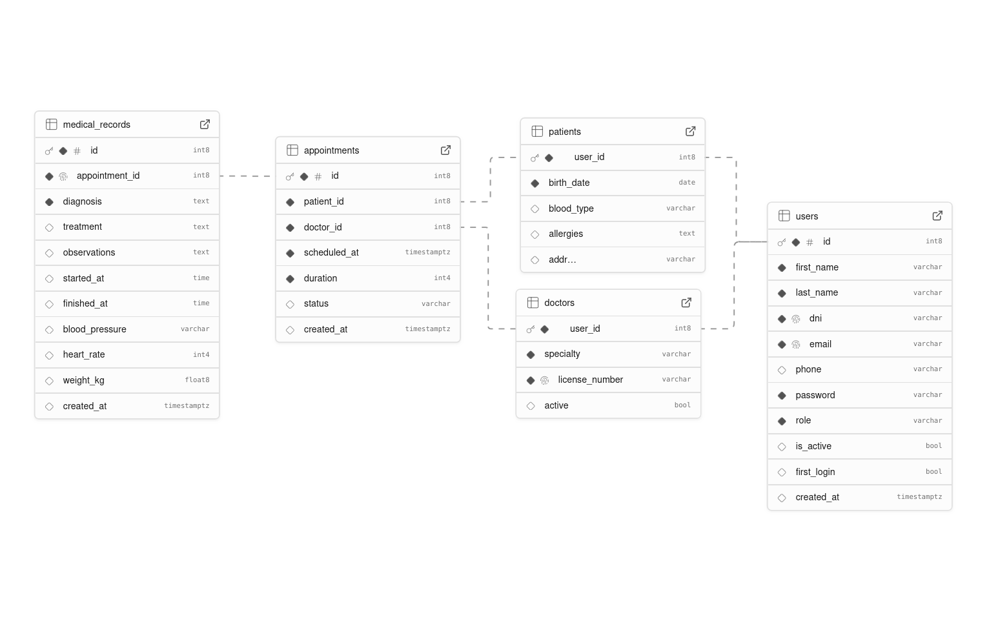
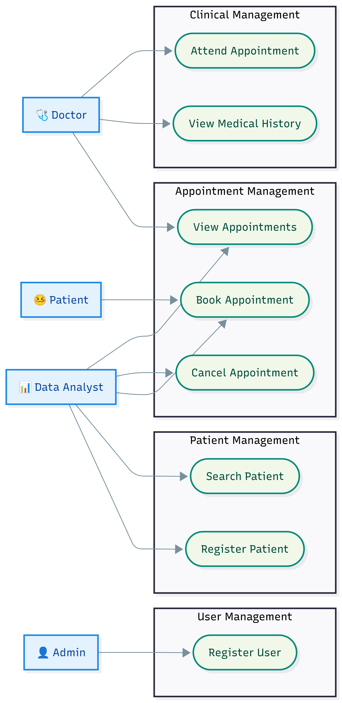
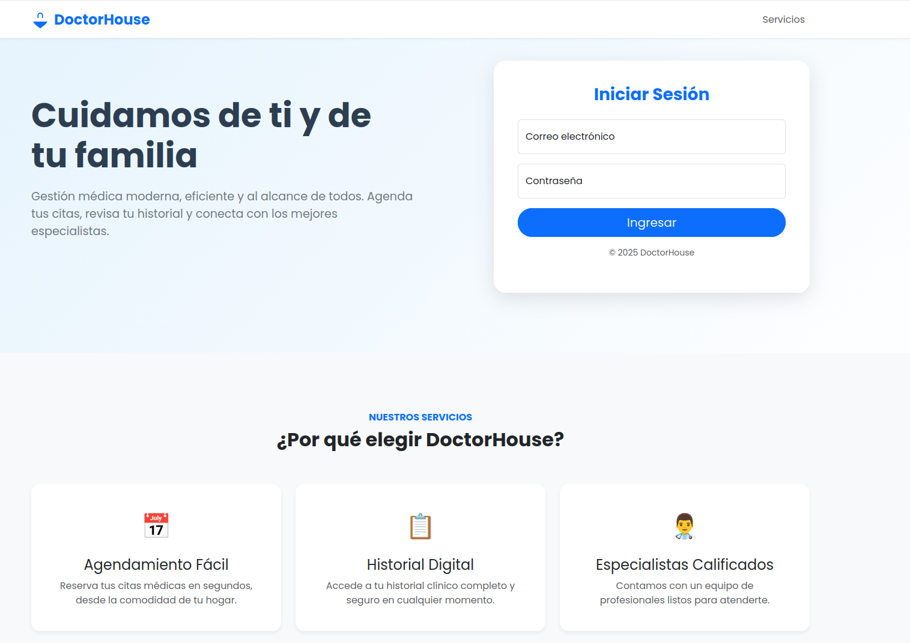
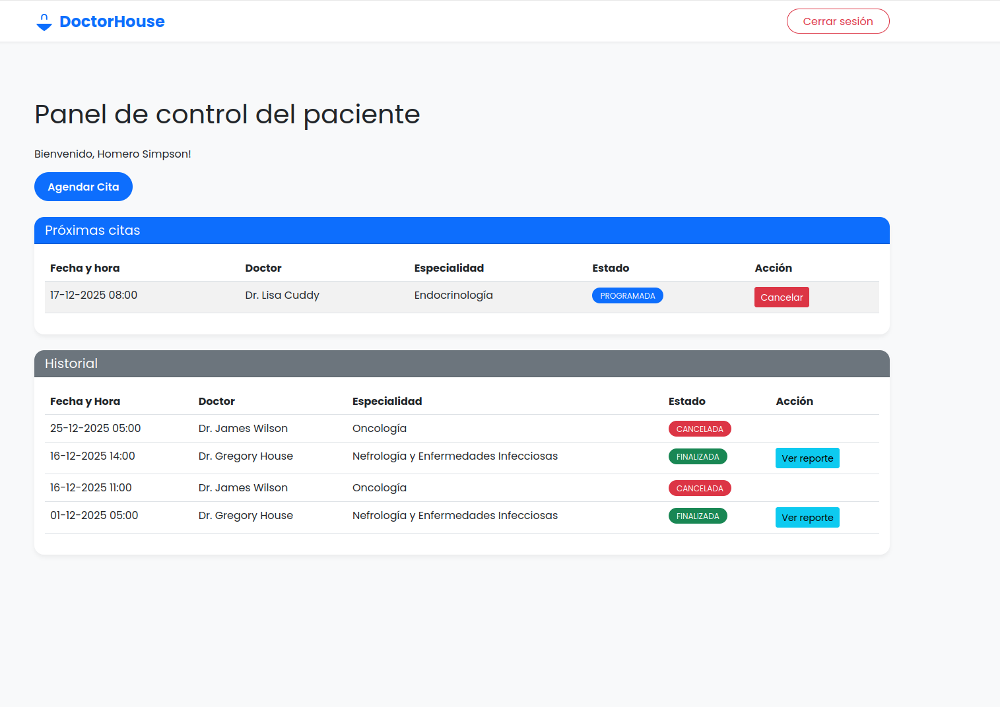

# DoctorHouse 🏥

[](https://adoptium.net/)
[](https://spring.io/projects/spring-boot)
[](https://www.docker.com/)

**DoctorHouse** is a robust medical management system built with modern Java technologies. It follows a **Hexagonal Architecture** (Ports and Adapters) to ensure separation of concerns, maintainability, and testability.

## 🚀 Key Features

*   **Role-Based Access Control**: Secure access for Doctors, Analysts, and Administrators.
*   **Medical Record Management**: Comprehensive handling of patient medical history.
*   **Appointment Scheduling**: Efficient booking and management of medical appointments.
*   **Modern Web Interface**: Responsive UI powered by Thymeleaf.
*   **RESTful API**: Well-structured API documented with Swagger/OpenAPI.

## 🛠 Tech Stack

*   **Language**: Java 21
*   **Framework**: Spring Boot 3.5.8
*   **Database**: PostgreSQL 15
*   **Migration**: Flyway
*   **Security**: Spring Security + JWT
*   **Build Tool**: Maven
*   **Containerization**: Docker & Docker Compose
*   **Utilities**: Lombok, MapStruct, Hibernate Validator

## 🏛 Architecture

The project is structured following the **Hexagonal Architecture**:

```
src/main/java/com/example/doctorhouse
├── application
│   └── service       # Business Logic Implementation (Use Cases)
├── domain
│   ├── model         # Core Business Objects (Entities)
│   └── port          # Interfaces (Input/Output Ports)
└── infrastructure
    ├── adapter       # Implementation of Ports (Web, Persistence, etc.)
    └── config        # Framework Configuration
```

## 📋 Prerequisites

*   [Docker](https://www.docker.com/get-started) & Docker Compose
*   [Java 21 JDK](https://adoptium.net/) (for local development)
*   [Maven](https://maven.apache.org/) (for local development)

## 🐳 Quick Start (Docker)

The easiest way to run the application is using Docker.

1.  **Clone the repository**:
    ```bash
    git clone <repository-url>
    cd DoctorHouse
    ```
2.  **Configure Environment**:
    Create a `.env` file in the root directory based on the example below:
    ```bash
    DB_URL=jdbc:postgresql://db:5432/doctorhouse  # For local docker-compose
    DB_USER=postgres
    DB_PASSWORD=postgres
    JWT_SECRET=your_super_secret_key_here
    PORT=8080
    ```

3.  **Start the application**:
    ```bash
    docker-compose up --build
    ```

4. **Access the application**:
    *   Web App: `http://localhost:8080`
    *   API Docs: `http://localhost:8080/swagger-ui.html`

5. 🔑 Default Credentials

To test the application immediately, use the following Admin credentials:
* **Username:** `analista@doctorhouse.com`
* **Password:** `12345`


* **Username:** `house@doctorhouse.com`
* **Password:** `12345`


* **Username:** `ironman@avengers.com`
* **Password:** `12345`

## 💻 Local Development

1.  **Configure Database**:
    Ensure you have a PostgreSQL database running and update `application.properties` or set environment variables:
    ```properties
    DB_URL=jdbc:postgresql://localhost:5432/doctorhouse
    DB_USER=postgres
    DB_PASSWORD=postgres
    ```

2.  **Run with Maven**:
    ```bash
    ./mvnw spring-boot:run
    ```

## 🧪 Testing

Run unit and integration tests:
```bash
./mvnw test
```

## Diagrams

### Database - ER Diagram


### Use Cases Diagram



## 🤝 Contributing

1.  Fork the repository.
2.  Create your feature branch (`git checkout -b feature/AmazingFeature`).
3.  Commit your changes (`git commit -m 'Add some AmazingFeature'`).
4.  Push to the branch (`git push origin feature/AmazingFeature`).
5.  Open a Pull Request.

> 🔴 **Live Demo:** [https://doctorhouse-x09r.onrender.com](https://doctorhouse-x09r.onrender.com)
> *Note: The server runs on a free tier, so it might take ~50 seconds to wake up on the first request.*

## 📸 Screenshots

| Login Page | Scheduling Appointment | Register |
|:----------:|:----------:|:-------:|
|  |  |  |